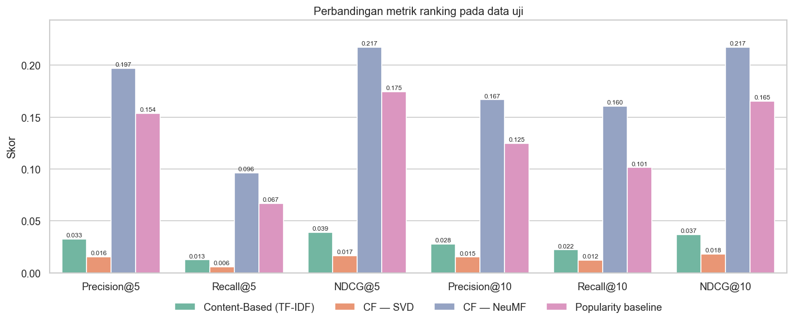

<div align="center">

# 🎬 Movie Recommendation System

**Content-Based Filtering × Collaborative Filtering (SVD & Neural CF) on MovieLens**

[](https://www.python.org/)
[](https://pytorch.org/)
[](https://scikit-learn.org/)
[](https://surpriselib.com/)
[](tests/)
[](LICENSE)

</div>

An end-to-end, reproducible recommender system that produces **top-N movie recommendations** with three models from two paradigms, and evaluates them fairly on the same held-out data:

| Paradigm | Model | Best at |
|---|---|---|
| Content-Based Filtering | **TF-IDF (genres + tags) + weighted cosine similarity** | "More like this", new movies, explainability, diversity |
| Collaborative Filtering | **SVD** (Surprise, grid-searched) | Rating prediction (lowest RMSE / MAE) |
| Collaborative Filtering | **NeuMF** — Neural Collaborative Filtering (PyTorch, CUDA) | Personalized top-N ranking (best Precision / Recall / NDCG) |

> Built as the final project for **Dicoding — Belajar Machine Learning Terapan** (Recommendation System). The submission report is written in Indonesian: [`laporan_proyek_machine_learning.md`](laporan_proyek_machine_learning.md).

---

## Table of Contents

- [Results](#-results)
- [System Architecture](#-system-architecture)
- [Directory Structure](#-directory-structure)
- [Getting Started](#-getting-started)
- [Usage](#-usage)
- [Methodology](#-methodology)
- [Evaluation Protocol](#-evaluation-protocol)
- [Key Design Decisions](#-key-design-decisions)
- [Testing & Code Quality](#-testing--code-quality)
- [Dicoding Submission](#-dicoding-submission)
- [Roadmap](#-roadmap)
- [References](#-references)
- [License](#-license)

---

## 📊 Results

Test set: 17,809 held-out ratings from 602 users (80:20 split per user). Relevant = test rating ≥ 4.0. Every model ranks the same 3,643 candidate movies, and movies a user already rated are hidden.

### Top-K ranking

| Model | Precision@10 | Recall@10 | NDCG@10 | Coverage@10 |
|---|---:|---:|---:|---:|
| Content-Based (TF-IDF) | 0.0279 | 0.0222 | 0.0368 | **0.4661** |
| CF — SVD | 0.0152 | 0.0125 | 0.0182 | 0.0571 |
| **CF — NeuMF** | **0.1667** | **0.1604** | **0.2173** | 0.1691 |
| Popularity baseline | 0.1248 | 0.1014 | 0.1653 | 0.0135 |

### Rating prediction

| Model | RMSE | MAE |
|---|---:|---:|
| **SVD** (`n_factors=100, n_epochs=30, lr_all=0.01, reg_all=0.1`) | **0.8410** | **0.6454** |
| Global-mean baseline | 1.0281 | 0.8182 |

<p align="center">
  
</p>

**Takeaways**

- **NeuMF** is the best top-N recommender. It beats the (strong) popularity baseline by **+31.5% NDCG@10** and **+58.2% Recall@10**, and its catalogue coverage is 12× wider.
- **SVD** gives the most accurate rating predictions but ranks poorly. The median popularity of its top-10 picks is only 9 ratings, so it surfaces obscure, high-bias titles. Low RMSE ≠ good top-N ([Cremonesi et al., 2010](https://doi.org/10.1145/1864708.1864721)).
- **Content-Based** has the most diverse recommendations and handles new movies (item cold start), e.g. *Toy Story* → *A Bug's Life*, *Toy Story 2*, *The Lego Movie*.

<details>
<summary><b>Sample output</b></summary>

**Movies similar to *Toy Story (1995)*** (Content-Based)

| # | Title | Similarity |
|---:|---|---:|
| 1 | Bug's Life, A (1998) | 0.7984 |
| 2 | Toy Story 2 (1999) | 0.6295 |
| 3 | The Lego Movie (2014) | 0.6016 |
| 4 | Up (2009) | 0.5035 |
| 5 | Monsters, Inc. (2001) | 0.5000 |

**Top-5 for user 1** (NeuMF — history dominated by Action / War / Drama)

| # | Title | Score |
|---:|---|---:|
| 1 | Mars Attacks! (1996) | 0.9551 |
| 2 | Face/Off (1997) | 0.9122 |
| 3 | Aliens (1986) | 0.9121 |
| 4 | True Lies (1994) | 0.9104 |
| 5 | Die Hard (1988) | 0.9006 |

</details>

---

## 🏗 System Architecture

```mermaid
flowchart TD
    subgraph Ingestion["1 · Data Ingestion"]
        A[GroupLens<br/>ml-latest-small.zip] -->|downloader.py| B[(data/raw<br/>movies · ratings · tags · links)]
        B -->|loader.py<br/>schema validation| C[MovieLensData]
    end

    subgraph Prep["2 · Data Preparation — preprocessor.py"]
        C --> D1[clean_movies<br/>Unknown genre · genre_list · year]
        C --> D2[clean_ratings<br/>range check · dedupe · datetime]
        C --> D3[clean_tags<br/>normalize · dedupe · aggregate]
        D1 & D3 --> E[build_movie_content<br/>genre_tokens + tags]
        D2 --> F[filter_cold_start<br/>users ≥ 20 · movies ≥ 5]
        F --> G[train_test_split_by_user<br/>80 : 20]
        G --> H[IdEncoder + user-item matrix]
    end

    subgraph Features["3 · Features"]
        E --> I[content_features.py<br/>TF-IDF genres ⊕ TF-IDF tags<br/>weighted, L2-normalized]
        H --> J[collaborative_features.py<br/>sparse user × item matrix]
    end

    subgraph Models["4 · Models"]
        I --> M1[ContentBasedRecommender<br/>item-to-item + user profile]
        J --> M2[SVDRecommender<br/>GridSearchCV 5-fold]
        J --> M3[NCFRecommender · NeuMF<br/>negative sampling · early stopping · CUDA]
        J --> M4[Popularity baseline]
    end

    subgraph Eval["5 · Evaluation — metrics.py"]
        M1 & M2 & M3 & M4 --> S[score matrix<br/>n_users × n_items]
        S --> R1[Precision@K · Recall@K · NDCG@K · Coverage]
        M2 --> R2[RMSE · MAE]
    end

    R1 & R2 --> O[(outputs/<br/>figures · results CSV)]
    M2 & M3 --> P[(models/saved<br/>svd_model.pkl · ncf_model.pth)]
    S --> T[Top-N recommendations]
```

Every recommender exposes the same contract: **a dense `[n_users × n_items]` score matrix**. The evaluation module, the top-N formatter and the baseline all work on that one interface, so adding a model means writing one `score_users()` method.

See [`docs/architecture.md`](docs/architecture.md) for module responsibilities, data contracts and the NeuMF network diagram.

---

## 📂 Directory Structure

```
movie-recommendation-system-ml/
│
├── README.md                          # You are here
├── laporan_proyek_machine_learning.md # Dicoding submission report (Indonesian)
├── sistem_rekomendasi_film.py         # Notebook exported as a script (submission)
├── CLAUDE.md                          # Context file for Claude Code
├── requirements.txt                   # Python dependencies
├── pyproject.toml                     # pytest + ruff configuration
├── LICENSE
│
├── notebooks/
│   └── sistem_rekomendasi_film.ipynb  # Self-contained, fully executed submission notebook
│
├── src/                               # Reusable, tested package
│   ├── config.py                      # Paths, seeds, hyperparameters (single source of truth)
│   ├── pipeline.py                    # End-to-end CLI: python -m src.pipeline
│   ├── data/
│   │   ├── downloader.py              # Download + extract MovieLens
│   │   ├── loader.py                  # Load CSVs + schema validation
│   │   └── preprocessor.py            # Cleaning, content docs, cold-start filter
│   ├── features/
│   │   ├── content_features.py        # Weighted genre/tag TF-IDF matrix
│   │   └── collaborative_features.py  # IdEncoder, per-user split, user-item matrix
│   ├── models/
│   │   ├── content_based.py           # TF-IDF + weighted cosine similarity
│   │   ├── svd_cf.py                  # Surprise SVD + grid search + vectorized scoring
│   │   ├── neural_cf.py               # PyTorch NeuMF (GMF + MLP), implicit feedback
│   │   └── baseline.py                # Popularity baseline
│   ├── evaluation/
│   │   └── metrics.py                 # RMSE, MAE, Precision@K, Recall@K, NDCG@K, coverage
│   └── utils/
│       ├── helpers.py                 # Seeding, logging, pickling, top-N formatting
│       └── visualization.py           # All 13 figures (embedded verbatim in the notebook)
│
├── tests/                             # 36 pytest tests on synthetic data (no download needed)
│   ├── conftest.py
│   ├── test_loader.py
│   ├── test_content_based.py
│   ├── test_collaborative.py
│   ├── test_metrics.py
│   └── test_visualization.py
│
├── scripts/
│   └── build_submission.py            # Packages the Dicoding .zip
│
├── docs/
│   ├── architecture.md                # Detailed system design
│   ├── model_card.md                  # Models, metrics, limitations, ethics
│   └── submission_checklist.md        # Dicoding rubric → where it is satisfied
│
├── data/                              # gitignored except .gitkeep
│   ├── raw/                           # movies.csv, ratings.csv, tags.csv, links.csv
│   └── processed/                     # tfidf_matrix.pkl, user_item_matrix.pkl
│
├── models/saved/                      # gitignored: svd_model.pkl, ncf_model.pth
│
└── outputs/
    ├── figures/                       # 13 figures used by the report (notebook or CLI, identical)
    └── results/                       # evaluation_metrics.csv, svd_grid_search.csv
```

---

## 🚀 Getting Started

### Prerequisites

- Python **3.10+** (tested on 3.12.4)
- Optional: NVIDIA GPU with CUDA 12.x (tested on an RTX 4050 Laptop GPU, 6 GB). Everything also runs on CPU.

### 1. Clone

```bash
git clone https://github.com/LouSens/movie-recommendation-system-ml.git
cd movie-recommendation-system-ml
```

### 2. Create an environment

```bash
conda create -n recsys python=3.12 -y
conda activate recsys
```

### 3. Install PyTorch (pick the build for your hardware)

```bash
# CUDA 12.4
pip install torch --index-url https://download.pytorch.org/whl/cu124
# CPU only
pip install torch --index-url https://download.pytorch.org/whl/cpu
```

### 4. Install the remaining dependencies

```bash
pip install -r requirements.txt
```

> `scikit-surprise` ships prebuilt wheels for recent Python versions. If pip tries to compile it, install *Microsoft C++ Build Tools* (Windows) or use `conda install -c conda-forge scikit-surprise`.

### 5. Verify the GPU (optional)

```bash
python -c "import torch; print(torch.cuda.is_available(), torch.cuda.get_device_name(0) if torch.cuda.is_available() else 'CPU')"
```

### 6. Download the dataset

```bash
python -m src.data.downloader
```

Files are extracted to `data/raw/`. The notebook and the pipeline also download the data automatically when it is missing.

---

## 🧑‍💻 Usage

### Run the full pipeline (CLI, optional)

The notebook alone produces everything the report and the submission need. The CLI is an alternative for working with the reusable `src/` package outside Jupyter.

```bash
python -m src.pipeline                # SVD grid search + NeuMF + evaluation (~40 s on RTX 4050)
python -m src.pipeline --skip-tuning  # reuse the best SVD params
python -m src.pipeline --skip-ncf     # no PyTorch needed
```

Artefacts: `models/saved/`, `data/processed/`, `outputs/results/pipeline_*.csv`, and the same 13 figures in `outputs/figures/` (same functions, data and model names as the notebook).

### Run the notebook

```bash
jupyter lab notebooks/sistem_rekomendasi_film.ipynb
```

The notebook is **self-contained**: it doesn't import `src/`, so it runs as-is in Google Colab or from inside a submission zip. Its plotting functions are copied verbatim from `src/utils/visualization.py` and placed in the section that uses them (EDA, Modeling, Evaluation), so the notebook and the CLI draw identical charts. It follows the same order as the report: *Data Loading → Data Understanding & EDA → Data Preparation → Modeling → Evaluation → Conclusion*.

### Use the package

```python
from src.data import load_movielens, clean_movies, clean_tags, clean_ratings, build_movie_content
from src.models import ContentBasedRecommender

raw = load_movielens()
movies = build_movie_content(clean_movies(raw.movies), clean_tags(raw.tags))
popularity = clean_ratings(raw.ratings)["movieId"].value_counts()

cbf = ContentBasedRecommender(movies, popularity=popularity).fit()
cbf.recommend_similar("The Matrix", top_n=10)
```

```python
from src.features import IdEncoder, train_test_split_by_user
from src.models.neural_cf import NCFRecommender
from src.utils import top_n_for_user

train, test = train_test_split_by_user(ratings)
users, items = IdEncoder.fit(train["userId"]), IdEncoder.fit(train["movieId"])
ncf = NCFRecommender(users, items).fit(train)            # CUDA if available
scores = ncf.score_users()                               # [n_users × n_items]
top_n_for_user(1, scores[users.to_index[1]], train, movies, items, score_name="score")
```

---

## 🔬 Methodology

### Data preparation

| Step | What | Why |
|---|---|---|
| Clean movies | `(no genres listed)` → `Unknown`, split genres, extract year | Avoid junk tokens, enable genre analysis |
| Clean ratings | Range check, dedupe user–movie pairs, parse timestamps | One rating per pair, no leakage |
| Clean tags | Lowercase, strip punctuation, dedupe (movie, tag), aggregate per movie | `Pixar` = `pixar`; stop repeated tags inflating TF |
| Content docs | Genres as single tokens (`Sci-Fi` → `scifi`) + tag document | Keep multi-word genres intact |
| Cold-start filter | Iteratively keep users ≥ 20 and movies ≥ 5 ratings | 1–4 ratings carry no collaborative signal (62% of movies dropped, 89% of ratings kept) |
| Split | 80:20 **per user**, ≥ 1 training rating each, seed 42 | Every test user is known and activity distribution is preserved |
| Encode | Contiguous ids + sparse user–item matrix (602 × 3,643) | Embedding indices, shared candidate set |

### Content-Based Filtering

Genres and tags are vectorized **separately** with TF-IDF, L2-normalized and stacked with weights `√w` and `√(1−w)`. The dot product of two rows is then

$$\text{sim}(a,b) = w\cos(\text{genre}_a,\text{genre}_b) + (1-w)\cos(\text{tag}_a,\text{tag}_b), \quad w=0.5$$

A single concatenated document let tag-heavy movies drown out their genres; separating the blocks raised NDCG@10 from 0.015 to 0.037 and put *Toy Story 2* back into *Toy Story*'s neighbours. Personalized scores come from a **mean-centred, rating-weighted user profile**.

### SVD

Funk-SVD with biases, `r̂ = μ + b_u + b_i + qᵢᵀpᵤ`, tuned with a 16-combination `GridSearchCV` (5-fold, training data only). Full score matrices are computed in one vectorized NumPy call from the learned factors and checked against `SVD.predict()`.

### Neural Collaborative Filtering (NeuMF)

GMF branch (element-wise product of embeddings) + MLP branch (`128 → 256 → 128 → 64 → 32`, ReLU, dropout 0.2), fused into a single logit (619,713 parameters). It is trained on **implicit feedback**: each rated movie is a positive, with **4 fresh negatives per positive every epoch**, `BCEWithLogitsLoss` and Adam (lr 1e-3, batch 2048). **Early stopping** tracks validation NDCG@10 on a 10% per-user hold-out from the training data (best epoch 8 of 13).

---

## 📏 Evaluation Protocol

| Metric | Formula | Measures |
|---|---|---|
| Precision@K | \|Rel ∩ Rec@K\| / K | Share of recommendations that are liked |
| Recall@K | \|Rel ∩ Rec@K\| / \|Rel\| | Share of liked movies that are found |
| NDCG@K | DCG@K / IDCG@K, DCG = Σ relᵢ / log₂(i+1) | Ranking quality: hits near the top count more |
| Coverage@10 | unique items in all top-10 lists / catalogue | Diversity |
| RMSE | √(Σ(r̂ − r)² / n) | Rating error, penalizes large misses |
| MAE | Σ\|r̂ − r\| / n | Average rating error in stars |

- Relevance threshold is **rating ≥ 4.0**, and users need at least one relevant test item (592 evaluated users).
- Items rated in training are masked before ranking.
- All models rank the **same candidate set**, and a **popularity baseline** is always reported as a sanity floor.

---

## 🧭 Key Design Decisions

| Decision | Rationale |
|---|---|
| **Weighted genre/tag blocks** instead of one TF-IDF document | Only 16% of movies have tags. Separate blocks keep genres meaningful and let tags add signal (2.5× better NDCG@10). |
| **NeuMF on implicit feedback** instead of rating regression | A rating-regression NCF (MSE loss) reached RMSE 0.846 but NDCG@10 of only 0.011. Top-N ranking is the product goal, so the model optimizes for it. |
| **Keep SVD for rating prediction** | Best RMSE/MAE. It also illustrates that RMSE-optimal ≠ ranking-optimal. |
| **Report a popularity baseline** | MovieLens popularity is a strong baseline. A personalized model is only useful if it beats it. |
| **Early stopping on validation NDCG@10** (not loss) | BCE loss keeps falling while ranking quality peaks early. Stop on the metric that matters. |
| **Unclipped SVD scores for ranking** | Clipping to 5.0 collapses many predictions into ties. |
| **Self-contained notebook + tested `src/` package** | The submission must run standalone. The package gives reuse, a CLI and unit tests. |
| **Local CUDA** | NeuMF trains in ~15 s on an RTX 4050 and there are no Colab session timeouts. Code falls back to CPU automatically. |

---

## 🧪 Testing & Code Quality

```bash
pytest                                  # 36 tests, ~15 s, synthetic fixtures (no dataset download)
pytest --cov=src --cov-report=term      # with coverage
ruff check src tests                    # lint (PEP 8, isort, pyupgrade rules)
```

Code style: PEP 8, Google-style docstrings, full type hints, 100-character lines.

---

## 📦 Dicoding Submission

```bash
python scripts/build_submission.py
```

This creates `dist/submission_movie_recommendation.zip` containing:

| File | Requirement |
|---|---|
| `sistem_rekomendasi_film.ipynb` | Executed Jupyter notebook |
| `sistem_rekomendasi_film.py` | Python script |
| `laporan_proyek_machine_learning.md` | Markdown report (Indonesian) |
| `outputs/figures/*.png` | Images referenced by the report, so it renders offline |

The rubric-to-evidence mapping is in [`docs/submission_checklist.md`](docs/submission_checklist.md).

---

## 🗺 Roadmap

- [x] Dataset download & schema validation
- [x] EDA pipeline (13 figures)
- [x] Content-Based Filtering (weighted TF-IDF)
- [x] SVD Collaborative Filtering with grid search
- [x] Neural CF (NeuMF, PyTorch CUDA)
- [x] Ranking + rating evaluation with baseline
- [ ] Hybrid model (CBF for cold start + NeuMF blend)
- [ ] Temporal (leave-last-out) evaluation
- [ ] FastAPI REST deployment (`/recommend/content`, `/recommend/collaborative`)
- [ ] Streamlit demo UI
- [ ] Docker containerization

---

## 📚 References

1. Harper, F. M., & Konstan, J. A. (2015). The MovieLens datasets: History and context. *ACM TiiS, 5*(4). https://doi.org/10.1145/2827872
2. Koren, Y., Bell, R., & Volinsky, C. (2009). Matrix factorization techniques for recommender systems. *Computer, 42*(8), 30–37. https://doi.org/10.1109/MC.2009.263
3. He, X., Liao, L., Zhang, H., Nie, L., Hu, X., & Chua, T.-S. (2017). Neural collaborative filtering. *WWW '17*, 173–182. https://doi.org/10.1145/3038912.3052569
4. Hu, Y., Koren, Y., & Volinsky, C. (2008). Collaborative filtering for implicit feedback datasets. *ICDM '08*, 263–272. https://doi.org/10.1109/ICDM.2008.22
5. Cremonesi, P., Koren, Y., & Turrin, R. (2010). Performance of recommender algorithms on top-N recommendation tasks. *RecSys '10*, 39–46. https://doi.org/10.1145/1864708.1864721
6. Rendle, S., Krichene, W., Zhang, L., & Anderson, J. (2020). Neural collaborative filtering vs. matrix factorization revisited. *RecSys '20*, 240–248. https://doi.org/10.1145/3383313.3412488
7. Järvelin, K., & Kekäläinen, J. (2002). Cumulated gain-based evaluation of IR techniques. *ACM TOIS, 20*(4), 422–446. https://doi.org/10.1145/582415.582418

---

## 📄 License

Released under the [MIT License](LICENSE). The MovieLens dataset is © GroupLens Research and is subject to its own [usage license](https://files.grouplens.org/datasets/movielens/ml-latest-small-README.html). It is not redistributed in this repository.

<div align="center">
<sub>Made by David Kurniawan · Dicoding Machine Learning Terapan</sub>
</div>
