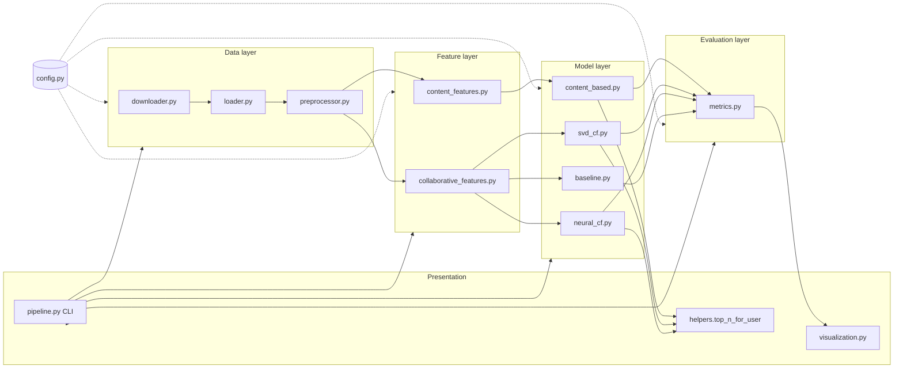
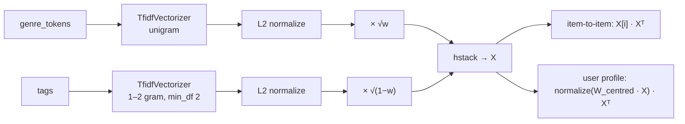
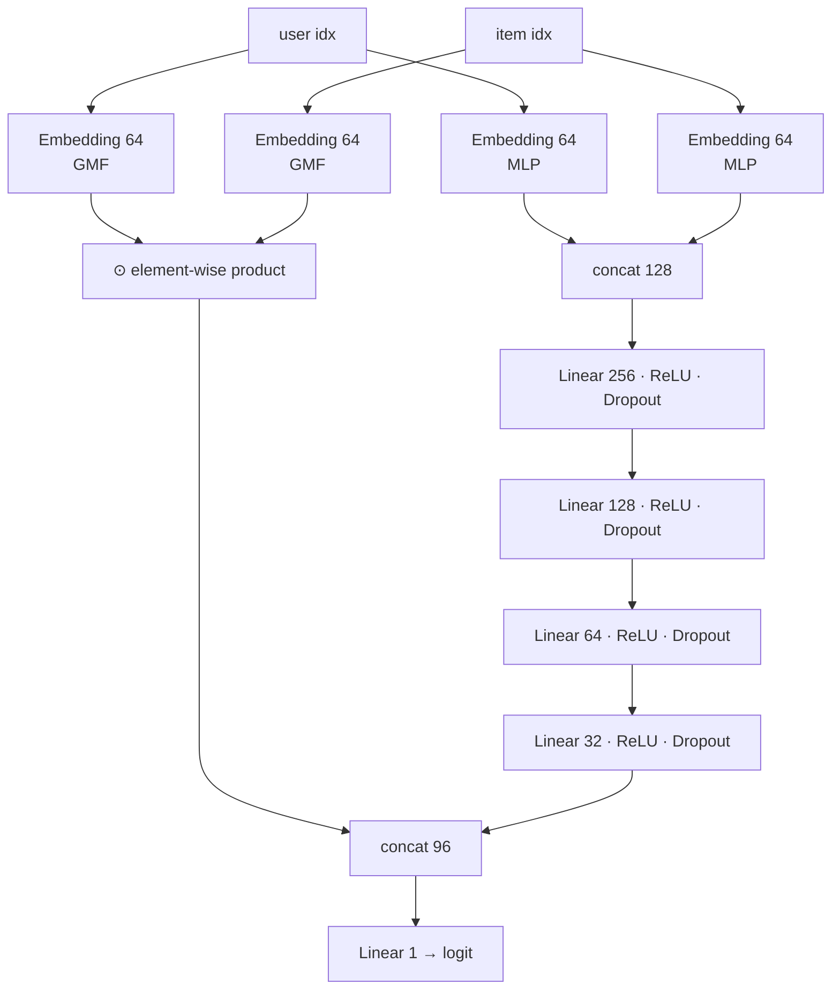
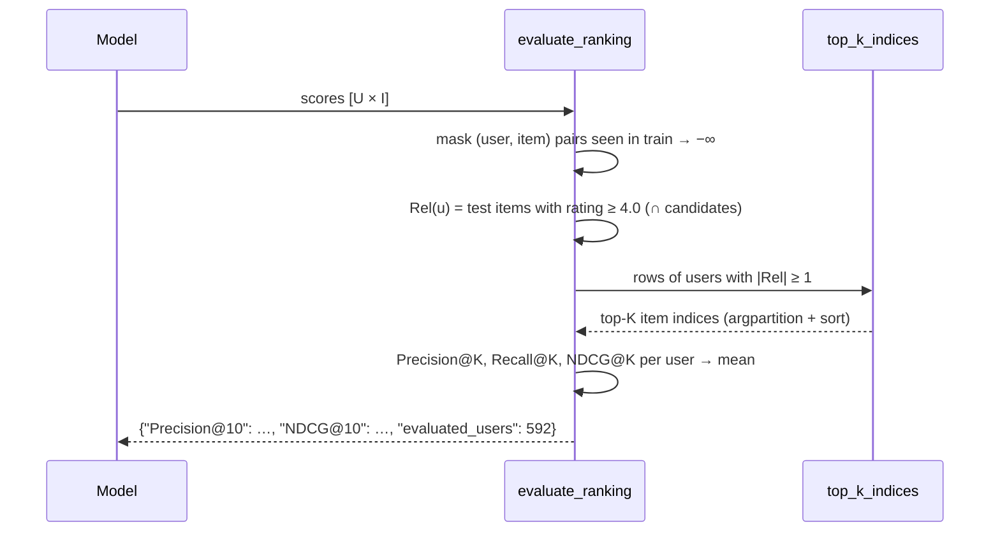

# System Architecture

This document describes how the recommender is put together: the layers, the data contracts between them, and how each model plugs into the shared evaluation.

## 1. Design goals

| Goal | How it is met |
|---|---|
| **Reproducible** | One `RANDOM_SEED` in `src/config.py`; seeded NumPy / PyTorch / Surprise; deterministic per-user split. Re-executing the notebook gives identical metrics. |
| **Fair comparison** | Every model outputs a score matrix over the **same** users × candidate movies, evaluated by one function with the same masking rules. |
| **Leak-free** | Hyperparameter search and early stopping only see training data. The test set is used once, at the end. |
| **Portable** | GPU is optional (auto-detected). The submission notebook has no dependency on `src/`. |
| **Testable** | Pure functions and small classes; 34 unit tests run on synthetic data in seconds. |

## 2. Layered view

Dependencies only point downward, e.g. models never import the pipeline, and metrics never import models. `neural_cf.py` is the only module that imports PyTorch, and it isn't re-exported from `src.models`, so the rest of the package works without torch.

## 3. Module responsibilities

| Module | Responsibility | Key API |
|---|---|---|
| `config.py` | Paths, seeds, thresholds, hyperparameter dataclasses | `TFIDF`, `SVD_CONFIG`, `NCF_CONFIG`, `TOP_K_VALUES` |
| `data/downloader.py` | Fetch and extract the GroupLens archive (idempotent) | `download_movielens(target_dir, force=False)` |
| `data/loader.py` | Read the four CSVs and validate columns + dtypes | `load_movielens() -> MovieLensData`, `validate_schema()` |
| `data/preprocessor.py` | Clean tables, build content documents, filter cold start | `clean_movies`, `clean_ratings`, `clean_tags`, `build_movie_content`, `filter_cold_start` |
| `features/content_features.py` | Weighted genre ⊕ tag TF-IDF matrix | `build_content_matrix(movies, config) -> ContentFeatures` |
| `features/collaborative_features.py` | Id encoding, per-user split, sparse user–item matrix | `IdEncoder`, `train_test_split_by_user`, `build_user_item_matrix`, `sparsity` |
| `models/content_based.py` | Item-to-item similarity and user-profile scoring | `ContentBasedRecommender.fit / recommend_similar / score_users` |
| `models/svd_cf.py` | Surprise SVD wrapper with grid search and vectorized scoring | `SVDRecommender.tune / fit / predict / score_users / recommend` |
| `models/neural_cf.py` | NeuMF network, negative sampling, early stopping | `NeuMF`, `NCFRecommender.fit / score_users / save` |
| `models/baseline.py` | Non-personalized popularity scores | `popularity_scores()` |
| `evaluation/metrics.py` | Rating and ranking metrics, masked top-K evaluation | `rmse`, `mae`, `precision_at_k`, `recall_at_k`, `ndcg_at_k`, `evaluate_ranking`, `catalog_coverage` |
| `utils/helpers.py` | Seeding, logging, pickling, timing, top-N table formatting | `top_n_for_user()` |
| `utils/visualization.py` | EDA and evaluation plots | `plot_*` |
| `pipeline.py` | Orchestrates everything; CLI flags `--skip-tuning`, `--skip-ncf` | `run()` |

## 4. Data contracts

| Artefact | Shape / schema | Produced by | Consumed by |
|---|---|---|---|
| `movies` (clean) | `movieId, title, genres, genre_list, year` | `clean_movies` | content builder, top-N formatter |
| `movies_content` | `+ tags, genre_tokens, content` | `build_movie_content` | `ContentBasedRecommender` |
| `ratings` (clean/filtered) | `userId, movieId, rating, timestamp, datetime` | `clean_ratings`, `filter_cold_start` | split, all CF models |
| `train`, `test` | same as ratings | `train_test_split_by_user` | models / evaluation |
| `IdEncoder` | `to_index: dict`, `to_id: ndarray` (sorted) | `IdEncoder.fit` | matrices, embeddings, evaluation |
| Content matrix | CSR `[n_movies × (20 + n_tag_terms)]`, rows follow `movies_content` | `build_content_matrix` | CBF |
| User–item matrix | CSR `[n_users × n_items]` float32 ratings | `build_user_item_matrix` | CBF profiles, sparsity stats |
| **Score matrix** | dense `float32 [n_users × n_items]`, rows/cols follow the encoders | every model's `score_users` | `evaluate_ranking`, `top_n_for_user` |

The **score matrix** is the one interface every model shares. Higher score means more recommended. The scale doesn't matter, because only the order within a row is used.

## 5. Model internals

### 5.1 Content-Based

- `X[a]·X[b] = w·cos_genre + (1−w)·cos_tag`, so `linear_kernel` gives the weighted cosine similarity.
- Ties (common for untagged movies) are broken by the movie's rating count.
- User weights are `rating − user_mean`: liked movies pull the profile closer, disliked ones push it away.

### 5.2 SVD

- `GridSearchCV(SVD, grid, cv=5, n_jobs=-1)` on training ratings; best params by mean RMSE.
- `score_users` builds `P_u`, `b_u`, `Q_i`, `b_i` aligned with the encoders and computes `μ + b_u + b_i + P Qᵀ` in one call. Unknown ids fall back to zero factors/biases, just like Surprise.
- Scores are **not clipped** when ranking (clipping creates ties at 5.0), but are clipped for display.

### 5.3 NeuMF

Training loop, once per epoch:

1. Rebuild the epoch dataset: all positives + `num_negatives × positives` negatives drawn uniformly. Any draw that collides with a known positive is redrawn, using vectorized `np.isin` over `user·n_items + item` keys.
2. Shuffle on the device and run mini-batches with Adam + `BCEWithLogitsLoss`.
3. Score all users × items on the GPU in 64-user chunks and compute validation NDCG@10 / Recall@10.
4. Keep the best `state_dict` and stop after `patience` epochs without improvement.

## 6. Evaluation flow

## 7. Runtime profile (RTX 4050 Laptop, i9-13650HX)

| Stage | Duration |
|---|---|
| Load + clean + filter | < 1 s |
| TF-IDF + CBF scores for all users | ~0.2 s |
| SVD GridSearchCV (16 × 5 folds, `n_jobs=-1`) | ~7–12 s |
| NeuMF training (13 epochs with early stopping) | ~15 s (first epoch includes CUDA warm-up) |
| Evaluation (4 models × 592 users) | ~2 s |
| Full notebook execution | ~2 min |

## 8. Extension points

- **New model:** implement `score_users(...) -> np.ndarray[n_users, n_items]`, add it to the `scores` dict in `pipeline.py`, and it gets every metric and plot for free.
- **Hybrid:** blend rank-normalized score matrices, e.g. `α·rank(NeuMF) + (1−α)·rank(CBF)`, and tune `α` on the validation split.
- **Serving:** save the encoders + `ncf_model.pth`, precompute top-N per user offline, and serve them from a FastAPI endpoint (see the roadmap).
