# Laporan Proyek Machine Learning - David Kurniawan

**Topik:** Sistem Rekomendasi Film — Content-Based Filtering & Collaborative Filtering
**Dataset:** MovieLens Latest Small (`ml-latest-small`), GroupLens Research
**Berkas pendukung:** `notebooks/sistem_rekomendasi_film.ipynb` dan `sistem_rekomendasi_film.py` (urutan tahapan sama dengan laporan ini)

---

## Project Overview

### Latar belakang

Layanan *streaming* dan katalog film digital menyediakan ribuan judul, jauh melebihi yang sanggup ditelusuri seorang pengguna. Terlalu banyak pilihan membuat pengguna lebih lama memutuskan dan kurang puas dengan pilihannya — fenomena yang dikenal sebagai *choice overload* [1]. Sistem rekomendasi menjawab masalah ini dengan menyaring katalog menjadi daftar pendek yang relevan untuk setiap individu [2].

Dampak bisnisnya nyata. Netflix melaporkan bahwa sekitar 80% jam tayang di platformnya berasal dari rekomendasi, dan kombinasi personalisasi serta rekomendasi diperkirakan menghemat lebih dari 1 miliar dolar AS per tahun karena menekan *churn* pelanggan [3]. Rekomendasi yang buruk sebaliknya membuat pengguna tidak menemukan tontonan yang cocok lalu berhenti berlangganan.

### Mengapa dan bagaimana masalah ini diselesaikan

Masalah ini penting diselesaikan karena:

1. **Bagi pengguna** — mengurangi waktu mencari film dan membantu menemukan judul yang sesuai selera, termasuk film yang tidak populer tetapi relevan.
2. **Bagi penyedia layanan** — meningkatkan *engagement*, waktu tonton, dan retensi pelanggan.

Ada dua keluarga pendekatan utama [2]:

* **Content-Based Filtering** merekomendasikan item yang **mirip dengan item yang disukai pengguna** berdasarkan atribut item (genre, tag, deskripsi) [4]. Pendekatan ini tidak bergantung pada pengguna lain sehingga dapat merekomendasikan film baru yang belum punya rating.
* **Collaborative Filtering** memanfaatkan **pola rating seluruh pengguna**: pengguna dengan riwayat serupa cenderung menyukai film yang serupa. *Matrix factorization* (SVD) menjadi standar industri sejak Netflix Prize [5], dan *Neural Collaborative Filtering* (NCF) memperluasnya dengan jaringan saraf untuk memodelkan interaksi non-linier [6].

Proyek ini membangun dan membandingkan kedua pendekatan tersebut pada dataset MovieLens [7], lalu mengukurnya dengan metrik yang sesuai untuk tugas rekomendasi *top-N*.

---

## Business Understanding

### Problem Statements

1. **Bagaimana merekomendasikan film yang mirip dengan film yang sedang dilihat/disukai pengguna** hanya dari informasi konten (genre dan tag), termasuk untuk film yang belum memiliki banyak rating?
2. **Bagaimana memprediksi rating yang akan diberikan pengguna** pada film yang belum ia tonton, memanfaatkan pola rating dari seluruh pengguna?
3. **Bagaimana menyusun daftar top-N film yang dipersonalisasi** sehingga film yang benar-benar akan disukai pengguna muncul di urutan teratas?
4. **Pendekatan/algoritma mana yang paling tepat** untuk masing-masing kebutuhan di atas, diukur dengan metrik yang objektif?

### Goals

1. Membangun model **Content-Based Filtering** yang menghasilkan *top-10* film paling mirip untuk sebuah judul, berdasarkan kemiripan genre dan tag, sekaligus mampu memberi rekomendasi personal dari profil konten pengguna.
2. Membangun model **Collaborative Filtering** yang memprediksi rating dengan galat serendah mungkin, diukur dengan **RMSE** dan **MAE** dan dibandingkan dengan baseline rata-rata global.
3. Menghasilkan **daftar top-N yang dipersonalisasi** dengan kualitas ranking terbaik, diukur dengan **Precision@K, Recall@K, dan NDCG@K** (K = 5 dan 10), serta mengalahkan baseline non-personal (*popularity*).
4. **Membandingkan** semua model pada data uji yang sama dan memilih model terbaik beserta alasannya.

### Solution Approach

Untuk mencapai tujuan tersebut, diajukan **dua pendekatan** dengan **tiga algoritma**:

| # | Pendekatan | Algoritma | Menjawab |
|---|---|---|---|
| 1 | **Content-Based Filtering** | TF-IDF (genre + tag) dengan *weighted cosine similarity*; profil konten pengguna untuk rekomendasi personal | Problem 1, 3 |
| 2a | **Collaborative Filtering** | **SVD** (*matrix factorization*, library Surprise) dengan *hyperparameter tuning* `GridSearchCV` 5-fold | Problem 2, 3 |
| 2b | **Collaborative Filtering** | **Neural Collaborative Filtering (NeuMF)** berbasis PyTorch, dilatih dengan *implicit feedback*, *negative sampling*, dan *early stopping* | Problem 3 |

Semua solusi **terukur**: CBF dan NeuMF dengan metrik ranking, SVD dengan RMSE/MAE **dan** metrik ranking. Sebuah **popularity baseline** (merekomendasikan film yang paling banyak disukai) ditambahkan sebagai tolok ukur minimum yang harus dilampaui model personal.

---

## Data Understanding

### Informasi dataset

Dataset yang digunakan adalah **MovieLens Latest Small (`ml-latest-small`)** yang dirilis GroupLens Research, University of Minnesota [7].

* **Sumber / tautan unduh:** <https://grouplens.org/datasets/movielens/latest/> — berkas langsung: <https://files.grouplens.org/datasets/movielens/ml-latest-small.zip>
* **Isi:** 4 berkas CSV — `movies.csv`, `ratings.csv`, `tags.csv`, `links.csv`
* **Rentang waktu rating:** 29 Maret 1996 – 24 September 2018

| Tabel | Baris | Kolom | Missing value | Duplikat |
|---|---:|---:|---:|---:|
| `movies` | 9.742 | 3 | 0 | 0 |
| `ratings` | 100.836 | 4 | 0 | 0 |
| `tags` | 3.683 | 4 | 0 | 0 |
| `links` | 9.742 | 3 | 8 (`tmdbId`) | 0 |

**Kondisi data:**

* **610** pengguna, **9.742** film di katalog (**9.724** pernah dirating), **100.836** rating.
* Matriks user-item sangat jarang: **sparsity 98,30%**.
* Tidak ada baris duplikat. Satu-satunya *missing value* ada pada 8 `tmdbId` di `links.csv` (tidak dipakai).
* **34** film berlabel genre `(no genres listed)`, **5** judul film duplikat (ID berbeda), dan **13** judul tanpa tahun rilis.
* Setiap pengguna memiliki **minimal 20 rating** (median 70,5; maksimum 2.698), sedangkan film memiliki median hanya **3 rating**. **3.446 film (35,4%)** hanya dirating satu kali.
* Tag hanya tersedia untuk **1.572 film (16,1%)**.

### Variabel-variabel pada dataset MovieLens

**`movies.csv`**
- `movieId` : ID unik film (integer), kunci penghubung antar tabel.
- `title` : judul film beserta tahun rilis dalam kurung, mis. `Toy Story (1995)`.
- `genres` : daftar genre dipisahkan `|` dari 20 label (Action, Adventure, Animation, Children, Comedy, Crime, Documentary, Drama, Fantasy, Film-Noir, Horror, IMAX, Musical, Mystery, Romance, Sci-Fi, Thriller, War, Western, `(no genres listed)`).

**`ratings.csv`**
- `userId` : ID unik pengguna (anonim).
- `movieId` : ID film yang dirating.
- `rating` : rating eksplisit berskala 0,5–5,0 dengan kelipatan 0,5.
- `timestamp` : waktu pemberian rating dalam detik sejak 1 Januari 1970 (UTC).

**`tags.csv`**
- `userId` : ID pengguna pemberi tag.
- `movieId` : ID film yang diberi tag.
- `tag` : label teks bebas buatan pengguna, mis. `pixar`, `atmospheric`, `twist ending`.
- `timestamp` : waktu pemberian tag.

**`links.csv`**
- `movieId` : ID film MovieLens.
- `imdbId` : ID film pada IMDb.
- `tmdbId` : ID film pada The Movie Database (TMDb).

### Exploratory Data Analysis

**1. Distribusi rating**

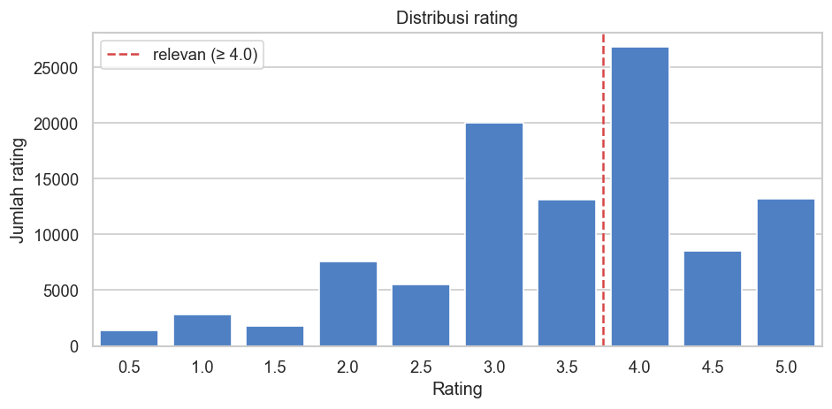

Rating condong ke nilai tinggi: nilai terbanyak adalah 4,0, lalu 3,0 dan 5,0, dengan rata-rata 3,50. Sebanyak **48,2%** rating bernilai ≥ 4,0, sehingga ambang **4,0** dipakai untuk mendefinisikan film yang *relevan/disukai* saat evaluasi.

**2. Frekuensi genre**

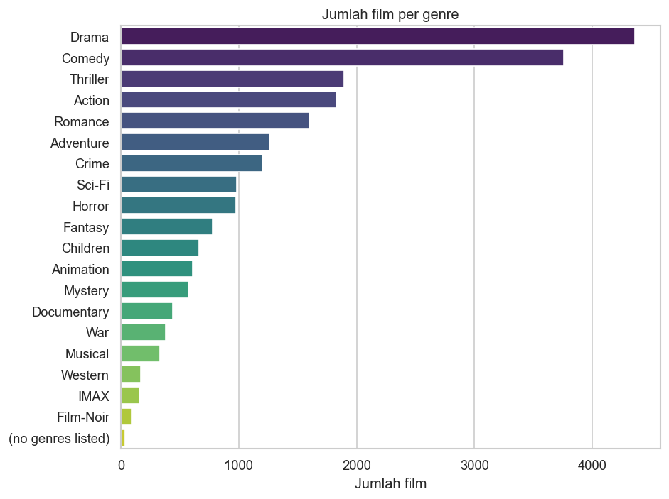

*Drama* (4.361 film) dan *Comedy* (3.756) mendominasi, sedangkan *Film-Noir* (87) dan *IMAX* (158) jarang. Rata-rata satu film memiliki 2,27 genre. Genre umum kurang membedakan satu film dari film lain, sehingga pembobotan **TF-IDF** yang menurunkan bobot genre umum sangat tepat.

**3. Aktivitas pengguna**

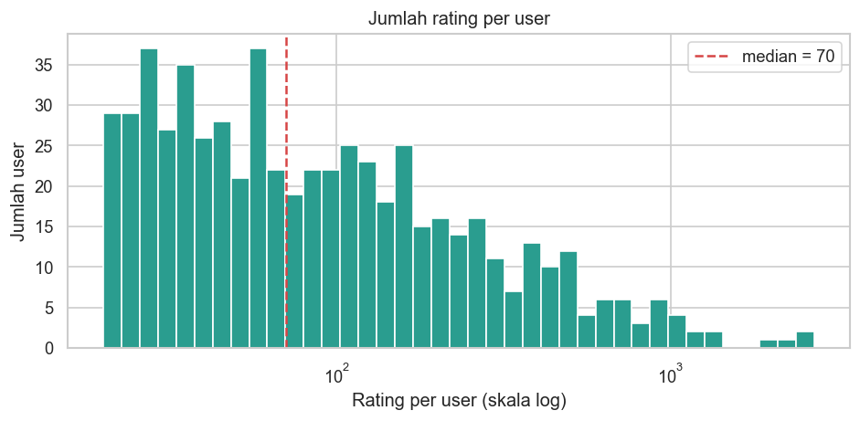

Distribusinya sangat miring ke kanan: median 70,5 rating, tetapi beberapa pengguna memberi ribuan rating. Karena itu data dibagi **per pengguna** agar setiap pengguna terwakili di data latih dan data uji.

**4. Popularitas film (*long tail*)**

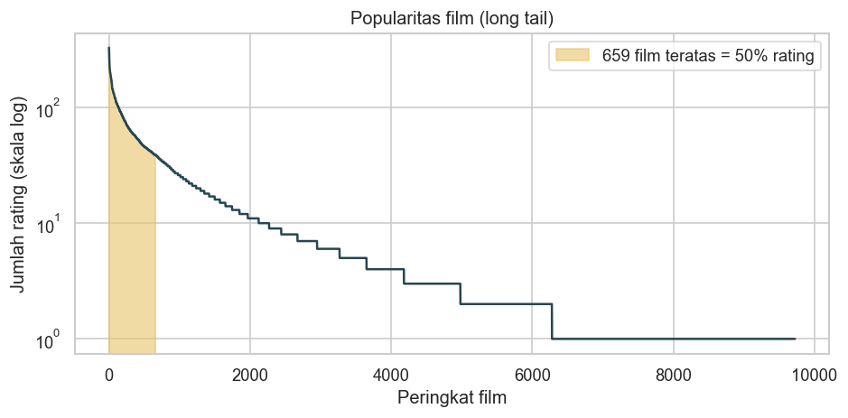

Hanya **659 film (6,8%)** yang menerima 50% seluruh rating, dan 35,4% film hanya punya satu rating. Film dengan rating sangat sedikit tidak memberi sinyal kolaboratif yang berarti, sehingga perlu **filter cold-start**.

**5. Rating per tahun**

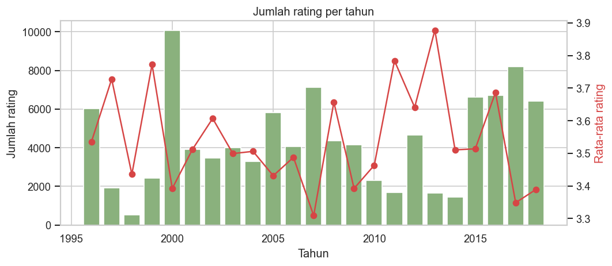

Volume rating per tahun tidak stabil (dipengaruhi segelintir pengguna yang sangat aktif), dengan rata-rata rating tahunan berkisar 3,3–3,9.

**6. Tag terpopuler**

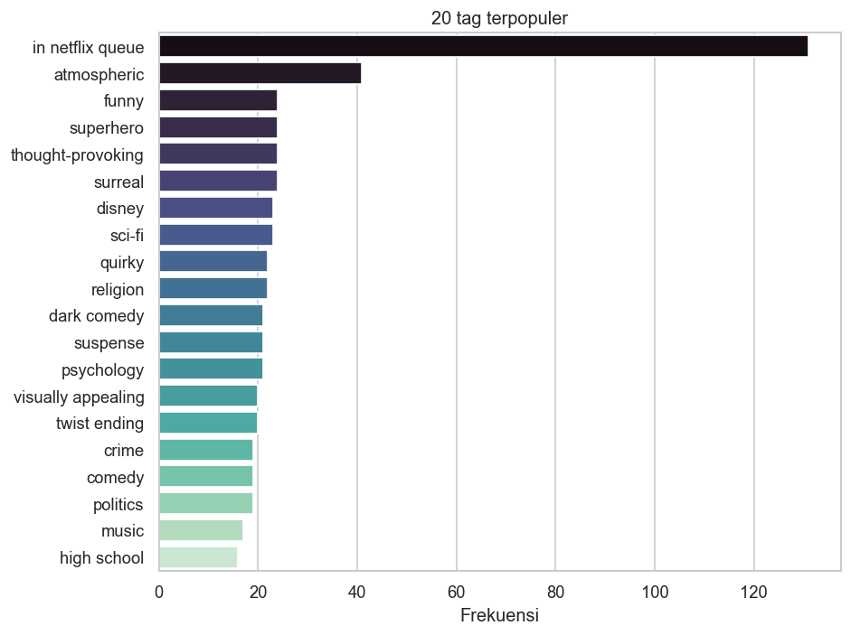

Tag memuat deskripsi yang kaya makna (*atmospheric*, *superhero*, *thought-provoking*, *disney*, *twist ending*). Tag terpopuler, *in netflix queue*, sebenarnya hanya penanda "ingin ditonton" dan menjadi *noise* kecil yang bobotnya diredam oleh IDF. Karena hanya 16,1% film yang memiliki tag, genre dan tag diperlakukan sebagai **dua blok fitur terpisah**.

**7. Rating per genre**

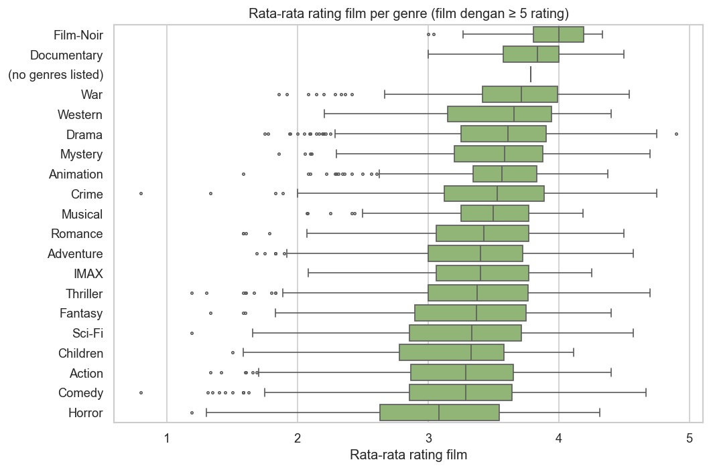

*Film-Noir*, *Documentary*, dan *War* memiliki median rating film tertinggi, sedangkan *Horror* terendah. Selisih antargenre kecil dibanding sebaran di dalam genre, jadi genre saja tidak cukup untuk memprediksi selera — pola kolaboratif tetap diperlukan.

**8. Sparsity matriks user-item**

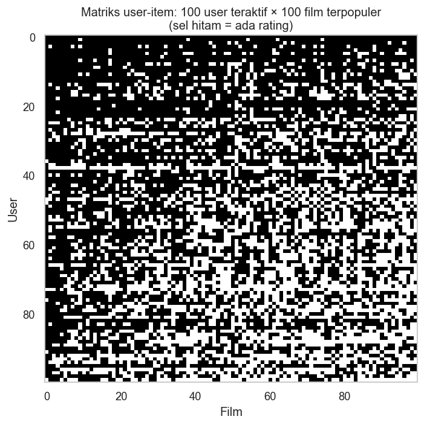

Bahkan blok 100 pengguna teraktif × 100 film terpopuler hanya terisi 62,4%, dan seluruh matriks hanya terisi 1,70%. Kondisi ini menjadi alasan memakai representasi laten (SVD, NeuMF) yang dapat menggeneralisasi ke pasangan user-film yang belum teramati.

---

## Data Preparation

Tahapan berikut dilakukan **berurutan**, sama dengan urutan di notebook (bagian 4.1–4.7).

### 1. Membersihkan data film

* Menghapus duplikat `movieId` dan spasi berlebih pada judul.
* Mengganti genre `(no genres listed)` pada 34 film dengan `Unknown`.
* Memecah `genres` menjadi list (`genre_list`) dan mengekstrak `year` dari judul dengan regex `\((\d{4})\)\s*$` (13 film tanpa tahun diberi nilai kosong).

**Alasan:** label `(no genres listed)` mengandung spasi dan tanda kurung yang akan terpecah menjadi token tidak bermakna saat vektorisasi. List genre dibutuhkan untuk analisis dan untuk menyusun token genre.

### 2. Membersihkan data rating

* Memastikan rating berada di rentang 0,5–5,0 dan tidak ada nilai kosong.
* Menghapus duplikat pasangan (`userId`, `movieId`) dan menyimpan rating terbaru.
* Mengonversi `timestamp` ke `datetime`.

**Alasan:** satu pengguna seharusnya hanya punya satu rating untuk satu film. Duplikat akan membuat bobot interaksi ganda dan bisa bocor antara data latih dan uji. Pada dataset ini tidak ditemukan pelanggaran (100.836 → 100.836), tetapi langkah ini menjamin *pipeline* tetap aman untuk versi data lain.

### 3. Membersihkan tag dan menggabungkannya per film

```python
def normalize_text(text):
    return re.sub(r"[^a-z0-9]+", " ", str(text).lower()).strip()

tags_clean["tag_clean"] = tags_clean["tag"].map(normalize_text)
tags_clean = tags_clean[tags_clean["tag_clean"] != ""]
tags_clean = tags_clean.drop_duplicates(subset=["movieId", "tag_clean"])
tag_docs = tags_clean.groupby("movieId")["tag_clean"].apply(" ".join)
```

* Tag diubah ke huruf kecil dan karakter non-alfanumerik diganti spasi (`"Sci-Fi"` → `"sci fi"`).
* Tag kosong dibuang dan pasangan (film, tag) yang sama dideduplikasi: **3.683 → 3.569** tag.
* Semua tag satu film digabung menjadi satu dokumen teks.

**Alasan:** `"Pixar"`, `"pixar"`, dan `"PIXAR "` harus dianggap token yang sama. Deduplikasi mencegah tag yang diberikan banyak pengguna mendapat bobot *term frequency* berlebih.

### 4. Menyusun fitur konten

* Setiap genre dijadikan **satu token** (`Sci-Fi` → `scifi`, `Film-Noir` → `filmnoir`) dan disimpan di kolom `genre_tokens`.
* Dokumen tag digabung ke tabel film (`left join`). Film tanpa tag diisi string kosong.

**Alasan:** tanpa langkah ini, `Sci-Fi` akan terpecah menjadi `sci` dan `fi`, sehingga kemiripan genre terdistorsi. Kolom genre dan tag disimpan terpisah agar dapat dibobot sendiri-sendiri pada tahap modeling.

### 5. Filter cold-start pengguna dan film

Pengguna dengan < 20 rating dan film dengan < 5 rating dibuang. Filter diulang sampai tidak ada perubahan, karena membuang film dapat membuat pengguna turun di bawah ambang (dan sebaliknya).

| | Sebelum | Sesudah |
|---|---:|---:|
| Rating | 100.836 | 90.109 |
| Pengguna | 610 | 602 |
| Film | 9.724 | 3.643 |

**Alasan:** model kolaboratif tidak dapat mempelajari representasi yang andal dari 1–4 rating, dan film seperti itu hanya menambah *noise*. 62% film terbuang, tetapi 89% rating tetap dipertahankan. Film baru yang terbuang tetap dapat dilayani oleh model Content-Based pada mode *item-to-item*.

### 6. Train/test split 80:20 per pengguna

Rating setiap pengguna diacak (seed 42), lalu 20% dijadikan data uji dan minimal satu rating selalu tetap di data latih. Film di data uji yang tidak muncul di data latih dibuang.

* **Data latih:** 72.300 rating · **Data uji:** 17.809 rating (8.876 di antaranya relevan, rating ≥ 4,0).

**Alasan:** pembagian per pengguna memastikan setiap pengguna di data uji sudah "dikenal" model dan distribusi aktivitas pengguna sama di kedua set. Tuning hyperparameter dan *early stopping* hanya memakai data latih, sehingga data uji benar-benar belum pernah dilihat.

### 7. Encoding ID dan matriks user-item

`userId` dan `movieId` dipetakan ke indeks berurutan `0..n-1`, lalu dibangun matriks *sparse* user-item berukuran **602 × 3.643** (terisi 72.300, sparsity 96,70%).

**Alasan:** *embedding layer* PyTorch dan operasi matriks membutuhkan indeks bilangan bulat berurutan. Himpunan 3.643 film di data latih juga menjadi **kandidat rekomendasi yang sama untuk semua model**, sehingga perbandingan adil.

---

## Modeling

Semua model menghasilkan matriks skor `[602 pengguna × 3.643 film]`. Rekomendasi *top-N* seorang pengguna adalah N film berskor tertinggi yang **belum pernah ia rating** di data latih. Contoh pengguna yang dipakai adalah **user 1**, yang riwayat rating tertingginya didominasi film *Action*, *War*, dan *Drama* (mis. *Tombstone*, *Schindler's List*, *Henry V*).

### 1. Content-Based Filtering — TF-IDF + Weighted Cosine Similarity

**Cara kerja**

1. **TF-IDF genre** pada 20 token genre dan **TF-IDF tag** pada dokumen tag (unigram + bigram, `min_df=2`, maks. 5.000 fitur → 1.114 fitur).
2. Setiap blok dinormalisasi L2, dikali `√w`, lalu digabung (1.134 fitur). Hasil kali titik dua film menjadi:

$$\text{sim}(a,b) = w\cdot\cos(\text{genre}_a,\text{genre}_b) + (1-w)\cdot\cos(\text{tag}_a,\text{tag}_b),\quad w = 0{,}5$$

3. **Item-to-item:** film diurutkan menurut similaritas terhadap film acuan. Jika skornya sama, film yang lebih populer didahulukan.
4. **Personal:** profil pengguna adalah jumlah vektor konten film yang ia rating, dibobot dengan `rating − rata-rata rating pengguna`. Film kandidat diurutkan berdasarkan kemiripan dengan profil tersebut.

```python
content_matrix = sparse.hstack([
    np.sqrt(GENRE_WEIGHT) * normalize(genre_tfidf),
    np.sqrt(1 - GENRE_WEIGHT) * normalize(tag_tfidf),
]).tocsr()
scores = linear_kernel(content_matrix[row], content_matrix).ravel()  # weighted cosine similarity
```

Genre dan tag sengaja dipisah. Pada percobaan awal yang menggabungkan keduanya dalam satu dokumen, film dengan banyak tag "menenggelamkan" genrenya, sehingga *Toy Story 2* tidak masuk top-10 untuk *Toy Story*.

**Hasil top-10 film mirip *Toy Story (1995)*** (genre: Adventure|Animation|Children|Comedy|Fantasy, tag: *pixar, fun*):

| # | Judul | Genre | Similarity |
|---:|---|---|---:|
| 1 | Bug's Life, A (1998) | Adventure\|Animation\|Children\|Comedy | 0,7984 |
| 2 | Toy Story 2 (1999) | Adventure\|Animation\|Children\|Comedy\|Fantasy | 0,6295 |
| 3 | The Lego Movie (2014) | Action\|Adventure\|Animation\|Children\|Comedy\|Fantasy | 0,6016 |
| 4 | Up (2009) | Adventure\|Animation\|Children\|Drama | 0,5035 |
| 5 | Monsters, Inc. (2001) | Adventure\|Animation\|Children\|Comedy\|Fantasy | 0,5000 |
| 6 | Antz (1998) | Adventure\|Animation\|Children\|Comedy\|Fantasy | 0,5000 |
| 7 | Emperor's New Groove, The (2000) | Adventure\|Animation\|Children\|Comedy\|Fantasy | 0,5000 |
| 8 | Shrek the Third (2007) | Adventure\|Animation\|Children\|Comedy\|Fantasy | 0,5000 |
| 9 | Moana (2016) | Adventure\|Animation\|Children\|Comedy\|Fantasy | 0,5000 |
| 10 | Adventures of Rocky and Bullwinkle, The (2000) | Adventure\|Animation\|Children\|Comedy\|Fantasy | 0,5000 |

Tiga teratas adalah film animasi yang berbagi genre **dan** tag (mis. *pixar*) dengan *Toy Story*. Film tanpa tag hanya bisa mencapai skor 0,5, karena komponen tagnya nol. Contoh lain di notebook: *The Matrix* → *Predator*, *The Terminator*, *Blade Runner*; *The Godfather* → *Goodfellas*, *Casino*, *Donnie Brasco*, *Godfather: Part II*.

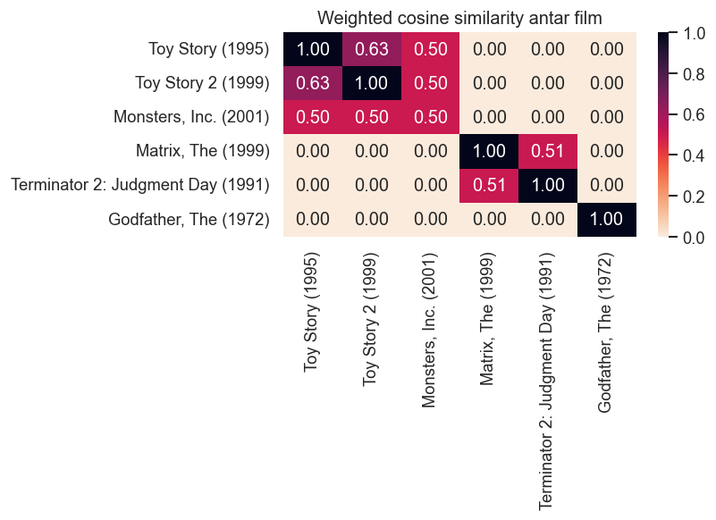

**Kelebihan:**
* Tidak butuh data pengguna lain dan dapat merekomendasikan film baru (*item cold-start*).
* Mudah dijelaskan ("karena Anda menyukai film animasi Pixar").
* Cepat: vektorisasi dan skor seluruh pengguna selesai kurang dari satu detik.
* Coverage katalog tinggi (rekomendasi beragam).

**Kekurangan:**
* Kualitas terbatas oleh metadata: genre terlalu umum dan hanya 16% film memiliki tag.
* Cenderung *over-specialization*, yaitu merekomendasikan film yang itu-itu saja dan kurang mampu memberi kejutan (*serendipity*).
* Tidak menangkap kualitas film maupun selera kolektif.

### 2. Collaborative Filtering — SVD (Matrix Factorization)

**Cara kerja.** SVD versi Funk pada library Surprise [5] memprediksi rating sebagai

$$\hat r_{ui} = \mu + b_u + b_i + q_i^\top p_u$$

dengan $\mu$ rata-rata global, $b_u$ dan $b_i$ bias pengguna dan film, serta $p_u, q_i$ vektor faktor laten berdimensi `n_factors`. Parameter dipelajari dengan *stochastic gradient descent* yang meminimalkan galat kuadrat ditambah regularisasi L2 (`reg_all`).

**Hyperparameter tuning** dengan `GridSearchCV` 5-fold **pada data latih saja** (16 kombinasi):

| Parameter | Ruang pencarian | Terbaik |
|---|---|---|
| `n_factors` | 50, 100 | **100** |
| `n_epochs` | 20, 30 | **30** |
| `lr_all` | 0,005; 0,01 | **0,01** |
| `reg_all` | 0,02; 0,1 | **0,1** |

Kombinasi terbaik mencapai **CV RMSE 0,8487** (MAE 0,6508), sedangkan yang terburuk (`n_factors=50, n_epochs=30, lr_all=0,01, reg_all=0,02`) mencapai 0,8880. Regularisasi yang lebih kuat (`reg_all=0,1`) selalu lebih baik — tanda bahwa data yang *sparse* rawan *overfitting*.

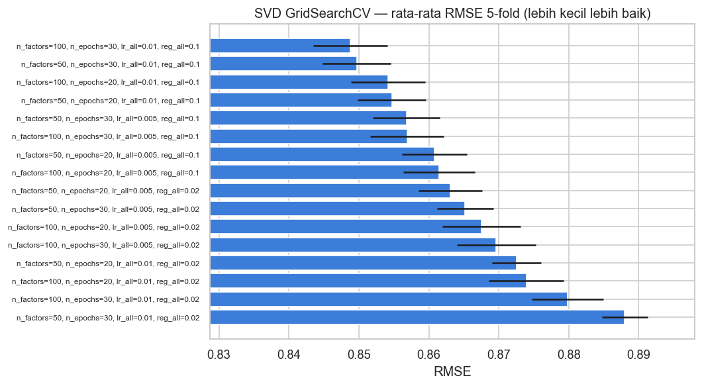

Model final dilatih ulang dengan parameter terbaik pada seluruh data latih. Skor seluruh pasangan user-film dihitung sekaligus dari faktor laten (vektorisasi NumPy), dan hasilnya sudah dicek sama dengan `svd_model.predict()`.

**Hasil top-10 SVD untuk user 1:**

| # | Judul | Genre | Prediksi rating |
|---:|---|---|---:|
| 1 | Louis C.K.: Live at the Beacon Theater (2011) | Comedy | 5,0 |
| 2 | The Artist (2011) | Comedy\|Drama\|Romance | 5,0 |
| 3 | Trial, The (Procès, Le) (1962) | Drama | 5,0 |
| 4 | His Girl Friday (1940) | Comedy\|Romance | 5,0 |
| 5 | Captain Fantastic (2016) | Drama | 5,0 |
| 6 | Three Billboards Outside Ebbing, Missouri (2017) | Crime\|Drama | 5,0 |
| 7 | Yojimbo (1961) | Action\|Adventure | 5,0 |
| 8 | Shawshank Redemption, The (1994) | Crime\|Drama | 5,0 |
| 9 | When We Were Kings (1996) | Documentary | 5,0 |
| 10 | Last Tango in Paris (Ultimo tango a Parigi) (1972) | Drama | 5,0 |

**Kelebihan:**
* Akurat untuk prediksi rating (RMSE terendah) dan tangguh pada data yang *sparse*.
* Cepat dilatih (grid search 80 *fit* ± 10 detik) dan faktor laten dapat dianalisis.
* Implementasi Surprise matang dan mudah direproduksi.

**Kekurangan:**
* Dioptimasi untuk menebak angka rating, **bukan** untuk ranking. SVD cenderung merekomendasikan film "klasik" yang sedikit dirating tetapi berbias tinggi (lihat bagian Evaluation).
* Tidak dapat melayani pengguna atau film baru (*cold-start*).
* Hanya menangkap interaksi linier (hasil kali titik).

### 3. Collaborative Filtering — Neural Collaborative Filtering (NeuMF)

**Arsitektur** (He et al., 2017 [6]):

```
user ─► GMF embedding (64) ─┐
item ─► GMF embedding (64) ─┴─► element-wise product ─────────────────────┐
                                                                          ├─► concat ─► Linear(1) ─► logit
user ─► MLP embedding (64) ─┐                                             │
item ─► MLP embedding (64) ─┴─► concat(128) ─► 256 ─► 128 ─► 64 ─► 32 ────┘
                                  (tiap layer: Linear → ReLU → Dropout 0,2)
```

Total **619.713 parameter**. Cabang GMF menggeneralisasi *matrix factorization*, sedangkan cabang MLP menangkap interaksi non-linier.

**Tahapan pelatihan dan parameter:**

1. **Implicit feedback [8]:** setiap film yang pernah dirating pengguna dianggap **positif (label 1)**. Tujuannya meranking film yang akan ditonton dan disukai, bukan menebak angka rating.
2. **Negative sampling:** untuk setiap positif diambil **4 film acak yang belum pernah dirating** pengguna sebagai **negatif (label 0)**. Sampel diambil ulang setiap epoch.
3. **Optimasi:** `BCEWithLogitsLoss`, Adam (lr = 0,001), batch 2.048, inisialisasi *embedding* N(0; 0,01), dilatih di GPU (CUDA) bila tersedia.
4. **Early stopping:** 10% rating latih tiap pengguna disisihkan sebagai validasi. Setiap epoch dihitung **NDCG@10 validasi**, dan bobot epoch terbaik disimpan (*patience* 5, maksimum 30 epoch).

```python
def forward(self, users, items):
    gmf = self.user_gmf(users) * self.item_gmf(items)
    mlp = self.mlp(torch.cat([self.user_mlp(users), self.item_mlp(items)], dim=-1))
    return self.output(torch.cat([gmf, mlp], dim=-1)).squeeze(-1)
```

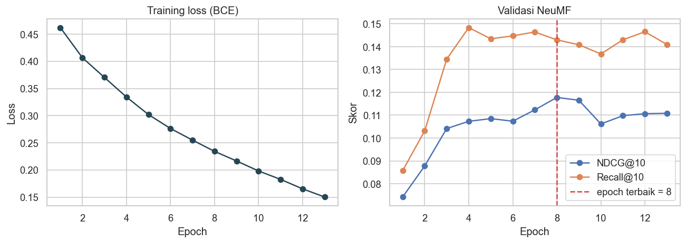

*Loss* latih terus turun, tetapi NDCG@10 validasi mencapai puncak **0,1178 pada epoch 8** lalu menurun. Pelatihan dihentikan pada epoch 13 dan bobot epoch 8 dipakai, sehingga *overfitting* dicegah.

**Hasil top-10 NeuMF untuk user 1:**

| # | Judul | Genre | Skor |
|---:|---|---|---:|
| 1 | Mars Attacks! (1996) | Action\|Comedy\|Sci-Fi | 0,9551 |
| 2 | Face/Off (1997) | Action\|Crime\|Drama\|Thriller | 0,9122 |
| 3 | Aliens (1986) | Action\|Adventure\|Horror\|Sci-Fi | 0,9121 |
| 4 | True Lies (1994) | Action\|Adventure\|Comedy\|Romance\|Thriller | 0,9104 |
| 5 | Die Hard (1988) | Action\|Crime\|Thriller | 0,9006 |
| 6 | Superman II (1980) | Action\|Sci-Fi | 0,8987 |
| 7 | Ghostbusters (a.k.a. Ghost Busters) (1984) | Action\|Comedy\|Sci-Fi | 0,8933 |
| 8 | Aladdin (1992) | Adventure\|Animation\|Children\|Comedy\|Musical | 0,8923 |
| 9 | Honey, I Shrunk the Kids (1989) | Adventure\|Children\|Comedy\|Fantasy\|Sci-Fi | 0,8916 |
| 10 | Beetlejuice (1988) | Comedy\|Fantasy | 0,8830 |

Rekomendasi NeuMF didominasi film *action* populer era 80–90-an yang sesuai dengan riwayat user 1.

**Kelebihan:**
* Dioptimasi langsung untuk tugas ranking top-N, dan terbukti memberi metrik ranking terbaik.
* Menangkap interaksi non-linier (MLP) sekaligus interaksi linier (GMF).
* Fleksibel untuk ditambah fitur lain (konten, konteks) dan memanfaatkan GPU.

**Kekurangan:**
* Lebih kompleks, lebih banyak hyperparameter, dan butuh GPU untuk data besar.
* Skor berupa probabilitas preferensi, bukan prediksi rating, sehingga RMSE/MAE tidak dapat dihitung.
* Kurang dapat dijelaskan dibanding CBF, serta tetap mengalami *cold-start*.
* Studi Rendle et al. [9] menunjukkan MF yang di-*tuning* dengan baik dapat menyaingi NCF, sehingga keunggulannya perlu divalidasi ulang pada data lain.

### Pemilihan model terbaik

Untuk tujuan utama sistem — **menyajikan top-N film yang dipersonalisasi** — **NeuMF dipilih sebagai model terbaik**. Model ini unggul di seluruh metrik ranking dan satu-satunya yang mengalahkan *popularity baseline* dengan selisih jelas. **SVD** dipakai bila dibutuhkan estimasi angka rating (RMSE/MAE terbaik), dan **Content-Based** dipakai untuk fitur "film serupa" serta film baru yang belum punya rating.

---

## Evaluation

### Metrik evaluasi

Rekomendasi dievaluasi dari dua sisi yang sesuai dengan *problem statement*.

**A. Metrik ranking top-K (Problem 1, 3, 4)** — untuk setiap pengguna, himpunan relevan $Rel$ adalah film di **data uji** yang ia beri rating **≥ 4,0**, dan $Rec@K$ adalah K rekomendasi teratas (film yang sudah dirating di data latih disembunyikan). Nilai akhir adalah rata-rata dari 592 pengguna yang memiliki minimal satu film relevan.

* **Precision@K** — proporsi rekomendasi yang tepat:
  $$\text{Precision@K} = \frac{|Rel \cap Rec@K|}{K}$$
  Contoh: 2 dari 10 rekomendasi disukai → Precision@10 = 0,2.

* **Recall@K** — proporsi film relevan yang berhasil ditemukan:
  $$\text{Recall@K} = \frac{|Rel \cap Rec@K|}{|Rel|}$$
  Contoh: pengguna menyukai 5 film di data uji dan 2 ada di top-10 → Recall@10 = 0,4.

* **NDCG@K** (*Normalized Discounted Cumulative Gain*) [10] — memperhitungkan **posisi**: film relevan di peringkat atas bernilai lebih besar.
  $$DCG@K = \sum_{i=1}^{K} \frac{rel_i}{\log_2(i+1)}, \qquad NDCG@K = \frac{DCG@K}{IDCG@K}$$
  dengan $rel_i = 1$ bila film peringkat ke-$i$ relevan, dan $IDCG@K$ adalah DCG urutan ideal (semua film relevan di atas), sehingga NDCG bernilai 0–1. Film relevan di peringkat 1 menyumbang 1, di peringkat 3 hanya $1/\log_2 4 = 0{,}5$.

* **Coverage@10** — proporsi dari 3.643 film kandidat yang muncul minimal sekali di top-10 seluruh pengguna (keragaman rekomendasi).

**B. Metrik prediksi rating (Problem 2)** — dihitung pada 17.809 rating data uji:

* **RMSE** (*Root Mean Squared Error*) — menghukum galat besar lebih berat karena dikuadratkan:
  $$RMSE = \sqrt{\frac{1}{n}\sum_{i=1}^{n}(\hat r_i - r_i)^2}$$
* **MAE** (*Mean Absolute Error*) — rata-rata selisih absolut dalam satuan bintang:
  $$MAE = \frac{1}{n}\sum_{i=1}^{n}|\hat r_i - r_i|$$

Metrik-metrik ini sesuai konteks: tujuan pengguna adalah melihat **daftar pendek** film yang disukai, sehingga Precision, Recall, dan NDCG pada K kecil lebih bermakna daripada akurasi rating semata [11]. RMSE/MAE tetap relevan untuk fitur yang menampilkan perkiraan rating.

### Hasil prediksi rating

| Model | RMSE | MAE |
|---|---:|---:|
| **SVD (tuned)** | **0,8410** | **0,6454** |
| Baseline rata-rata global | 1,0281 | 0,8182 |

SVD menurunkan RMSE sebesar **18,2%** dan MAE sebesar **21,1%** dibanding menebak rata-rata global. Rata-rata meleset ±0,65 bintang **menjawab Goal 2**.

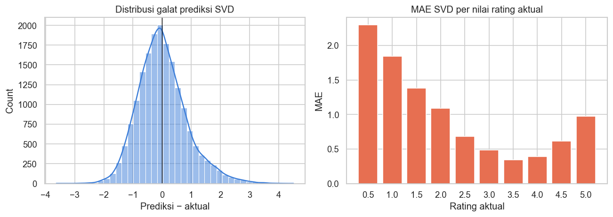

Galat terdistribusi di sekitar nol. MAE terkecil ada pada rating 3,5–4,0 yang paling sering muncul, sedangkan galat terbesar ada pada rating ekstrem, terutama 0,5–1,5 (MAE > 1,3) dan 5,0. Model cenderung menarik prediksi ke arah rata-rata, yang merupakan efek wajar dari regularisasi.

### Hasil ranking top-K

| Model | Precision@5 | Recall@5 | NDCG@5 | Precision@10 | Recall@10 | NDCG@10 | Coverage@10 |
|---|---:|---:|---:|---:|---:|---:|---:|
| Content-Based (TF-IDF) | 0,0328 | 0,0126 | 0,0391 | 0,0279 | 0,0222 | 0,0368 | **0,4661** |
| CF — SVD | 0,0155 | 0,0058 | 0,0166 | 0,0152 | 0,0125 | 0,0182 | 0,0571 |
| **CF — NeuMF** | **0,1970** | **0,0963** | **0,2174** | **0,1667** | **0,1604** | **0,2173** | 0,1691 |
| Popularity baseline | 0,1537 | 0,0668 | 0,1747 | 0,1248 | 0,1014 | 0,1653 | 0,0135 |


**Interpretasi:**

1. **NeuMF terbaik di semua metrik ranking.** Dari 10 film yang direkomendasikan, rata-rata 1,67 film memang disukai pengguna di data uji. NeuMF menemukan 16% film yang disukai dan menaruhnya di posisi atas (NDCG@10 = 0,217). Dibanding *popularity baseline*, NeuMF lebih baik **+33,6%** pada Precision@10, **+58,2%** pada Recall@10, dan **+31,5%** pada NDCG@10, dengan coverage **12 kali lebih luas** (16,9% vs 1,4% katalog). Artinya, rekomendasinya benar-benar personal, bukan sekadar daftar film terlaris. **Goal 3 tercapai.**
2. **SVD akurat memprediksi rating tetapi lemah untuk ranking.** Median jumlah rating film di top-10 SVD hanya **9**, di bawah median seluruh kandidat (10), sedangkan NeuMF **107** dan baseline 175. SVD mendorong film yang jarang ditonton dengan bias rating tinggi ke atas, padahal film seperti itu jarang muncul di data uji. Temuan ini sejalan dengan Cremonesi et al. [11]: model dengan RMSE terbaik belum tentu terbaik untuk top-N. Karena itu kedua jenis metrik perlu dilaporkan.
3. **Content-Based** mengungguli SVD pada metrik ranking dan memiliki **coverage tertinggi (46,6%)**, sehingga rekomendasinya paling beragam. Namun akurasinya jauh di bawah model kolaboratif karena metadata terbatas. Nilai utamanya ada pada rekomendasi *item-to-item* yang relevan dan dapat dijelaskan (contoh *Toy Story* → *A Bug's Life*, *Toy Story 2*), sehingga **Goal 1 tercapai**.
4. **Goal 4:** perbandingan pada data uji dan kandidat yang sama menunjukkan pembagian peran yang jelas: NeuMF untuk "rekomendasi untuk Anda", SVD untuk estimasi rating, dan CBF untuk "film serupa" dan film baru.

### Kesimpulan

Seluruh *problem statement* terjawab. Sistem rekomendasi film berhasil dibangun dengan dua pendekatan: **Content-Based Filtering** (TF-IDF + *weighted cosine similarity*) dan **Collaborative Filtering** (SVD dan NeuMF). Masing-masing menghasilkan rekomendasi top-10. **NeuMF** memberi kualitas ranking terbaik (NDCG@10 = 0,2173) dan mengalahkan baseline popularitas, **SVD** memberi prediksi rating paling akurat (RMSE = 0,8410), dan **Content-Based** memberi rekomendasi item-to-item yang beragam dan mudah dijelaskan. Pengembangan berikutnya adalah model *hybrid* (CBF untuk *cold-start* + NeuMF untuk pengguna lama), menambah metadata seperti sinopsis dan pemeran, serta evaluasi berbasis waktu (*temporal split*).

---

## Referensi

[1] Schwartz, B. (2004). *The Paradox of Choice: Why More Is Less*. New York: Ecco/HarperCollins.

[2] Ricci, F., Rokach, L., & Shapira, B. (2015). Recommender systems: Introduction and challenges. In F. Ricci, L. Rokach, & B. Shapira (Eds.), *Recommender Systems Handbook* (2nd ed., pp. 1–34). Springer. https://doi.org/10.1007/978-1-4899-7637-6_1

[3] Gomez-Uribe, C. A., & Hunt, N. (2015). The Netflix recommender system: Algorithms, business value, and innovation. *ACM Transactions on Management Information Systems, 6*(4), Article 13. https://doi.org/10.1145/2843948

[4] Lops, P., de Gemmis, M., & Semeraro, G. (2011). Content-based recommender systems: State of the art and trends. In F. Ricci, L. Rokach, B. Shapira, & P. B. Kantor (Eds.), *Recommender Systems Handbook* (pp. 73–105). Springer. https://doi.org/10.1007/978-0-387-85820-3_3

[5] Koren, Y., Bell, R., & Volinsky, C. (2009). Matrix factorization techniques for recommender systems. *Computer, 42*(8), 30–37. https://doi.org/10.1109/MC.2009.263

[6] He, X., Liao, L., Zhang, H., Nie, L., Hu, X., & Chua, T.-S. (2017). Neural collaborative filtering. In *Proceedings of the 26th International Conference on World Wide Web* (pp. 173–182). https://doi.org/10.1145/3038912.3052569

[7] Harper, F. M., & Konstan, J. A. (2015). The MovieLens datasets: History and context. *ACM Transactions on Interactive Intelligent Systems, 5*(4), Article 19. https://doi.org/10.1145/2827872

[8] Hu, Y., Koren, Y., & Volinsky, C. (2008). Collaborative filtering for implicit feedback datasets. In *2008 Eighth IEEE International Conference on Data Mining* (pp. 263–272). https://doi.org/10.1109/ICDM.2008.22

[9] Rendle, S., Krichene, W., Zhang, L., & Anderson, J. (2020). Neural collaborative filtering vs. matrix factorization revisited. In *Proceedings of the 14th ACM Conference on Recommender Systems* (pp. 240–248). https://doi.org/10.1145/3383313.3412488

[10] Järvelin, K., & Kekäläinen, J. (2002). Cumulated gain-based evaluation of IR techniques. *ACM Transactions on Information Systems, 20*(4), 422–446. https://doi.org/10.1145/582415.582418

[11] Cremonesi, P., Koren, Y., & Turrin, R. (2010). Performance of recommender algorithms on top-N recommendation tasks. In *Proceedings of the Fourth ACM Conference on Recommender Systems* (pp. 39–46). https://doi.org/10.1145/1864708.1864721

**---Ini adalah bagian akhir laporan---**
